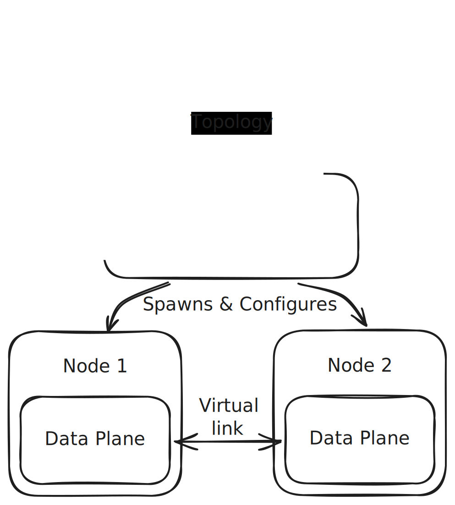

# usernet

**usernet** is a user space network emulator designed for educational research into network protocols.

## Architecture

The system follows a split architecture design, separating orchestration logic from packet processing.

### Control Plane

Written in _golang_. It acts as the orchestrator, responsible for:

- Parsing topology configurations.
- Managing the lifecycle of network nodes using `libcontainer`.
- Setting up the virtual network environment and isolation.

### Data Plane

Written in _rust_. It runs as a binary inside the containerized nodes, responsible for:

- Intercepting traffic from the virtual interface.
- Implementing the network stack in user space.
- Handling packet switching and routing logic.

### Design Overview

  

## Roadmap

### L2 Data Link

- [ ] Ethernet II
- [ ] ARP
- [ ] L2 Switching

### L3 Network

- [ ] IPv4
- [ ] ICMP
- [ ] Static Routing

### L4 Transport

- [ ] UDP
- [ ] TCP
